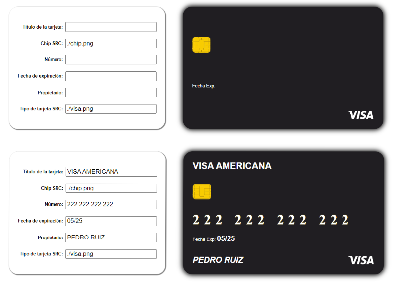

Desarrolladora : Ana Celeste Pérez 
# Desafío - Binding de formularios (I)
Este proyecto es una aplicación simple en Vue.js que permite a los usuarios ingresar y visualizar los detalles de una tarjeta de crédito.

## Características
-Formulario para ingresar los datos de la tarjeta.
-Vista previa en tiempo real de la tarjeta con los datos ingresados.

## Tecnologías Utilizadas
-Vue.js   
-HTML   
-CSS

## Instalación
-Clona el repositorio.
-Navega al directorio del proyecto.
-Instala las dependencias.

## Ejecución
Para ejecutar la aplicación en un servidor local, usa el siguiente comando:

`npm run serve`.

## Requerimientos

1. Enlazar el valor de los inputs con el estado de manera bidireccional usando el v-model.

2. Interpolar en las etiquetas que correspondan las variables del estado.

3. Crear las variables del estado correspondiente a la información de la tarjeta.

4. Enlazar las rutas de las imágenes usando el binding unidireccional en el atributo src.

## Problemas
Al querer `Enlazar las rutas de las imágenes usando el binding unidireccional en el atributo src.`  se tuvo problemas. La solución fue cambiar la imagen para la carpeta pública y la ruta quedaría asi :
`./ejemplo.png`. No se si es la mejor solución en caso de que se tengan mas imagenes..
